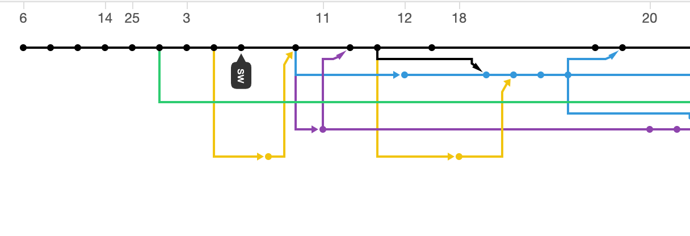
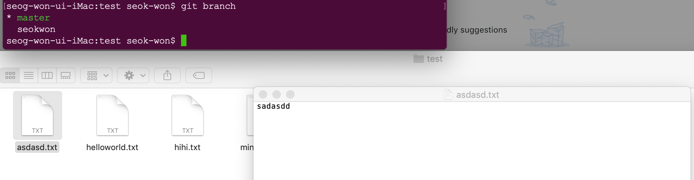

# git은 무엇인가요?

https://backlog.com/git-tutorial/kr/intro/intro1_1.html

# 시작

[git 다운로드 사이트](https://git-scm.com/downloads)

git을 다운로드 받고 모든 정보를 추적하고 싶은 디렉토리로 이동해서 `git init`을 입력합니다. 그러면 해당 디렉토리의 내용물은 모두 git으로 추적됩니다.

# git의 저장 단계

git은 파일의 이력을 여러 단계로 나누어서 관리합니다. 파일에서 우리가 수정한 정보는 아래와 같은 순서로 저장 공간을 옮겨 갑니다.

1. 작업트리

  git에서는 디렉토리를 작업트리라고 합니다. 우리가 파일을 만들어서 무언가 수정을 하면 자동으로 작업트리에 반영이 됩니다.
2. 인덱스

  작업트리의 정보를 `git add (파일명)`명령어를 입력하여 인덱스라는 공간에 올려야 합니다. 인덱스에 없고 작업트리에만 있는 수정사항은 로컬저장소로 `commit`할 수 없습니다.
3. 로컬 저장소

  인덱스에 있는 수정 정보를 `git commit -m "(수정사항에 관한 메시지)"`명령어로 로컬 저장소에 올립니다. 변경에 관한 짧은 설명은 꼭!! 써주어야 합니다.
4. 원격 저장소

  로컬 저장소(내 컴퓨터)에 있는 정보를 원격저장소(github, gitbucket...)등에 올리려면 `git push origin (branch명)`명령어를 입력합니다.

# branch, 가지치기

git의 branch 기능은 하나의 프로젝트에 여러 팀이 함께 작업할때 사용하는 기능입니다.

예를 들어서 게임을 만드는 프로젝트에 여러 작업이 있겠죠?

- 캐릭터 디자인
- 물리엔진
- UI디자인
- 실시간 서버 통신 시스템
- 채팅 시스템
- 보이스챗

이것보다 더 많을 것입니다. 그러나 이 수많은 팀들이 한꺼번에 하나의 폴더안의 파일들을 수정한다면 분명 이것 저것 꼬일 것입니다.



그떄 위와 같이 작업을 여러 버전으로 나누어서 따로 개발을 한다면 서로 꼬일일은 없을 것입니다. 있다면 branch를 통합할때 정도 잠간 코드를 살펴 봐야 하겠네요 

## branch 생성

자신의 repository에서 브랜치는 다음과 같이 생성합니다.

```
git branch (브랜치명)
```



현재 master branch브랜치의 내용은 위와 같습니다. 이제 브랜치 이동을 해보겠습니다.

## branch 이동

```
git checkout (브랜치명)
```
